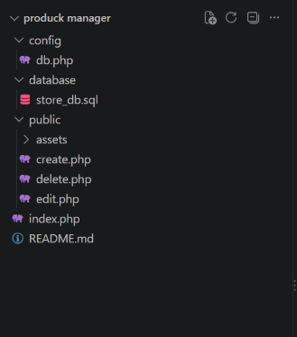
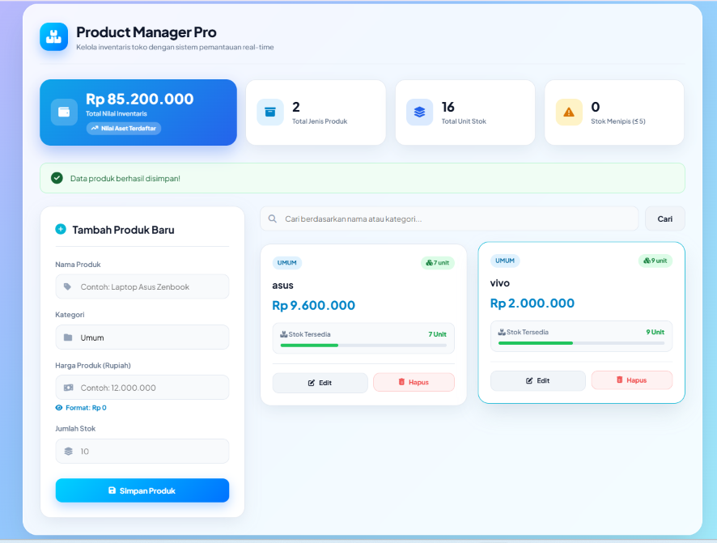

## Product Manager Pro
 adalah aplikasi manajemen inventaris berbasis web yang dirancang menggunakan bahasa pemrograman PHP Native dengan arsitektur berstandar industri. Aplikasi ini menyediakan solusi CRUD (Create, Read, Update, Delete) lengkap, responsif, dan aman untuk pengelolaan stok barang, pemantauan aset, serta manipulasi data katalog secara real-time.

 ## fitur utama
 # Dashboard & Analisis Inventaris:
 Pemantauan akumulasi total jenis produk dan stok barang secara keseluruhan.Visualisasi stok kritis/menipis ($\le 5$ unit) dengan indikator dinamis.
 # Manajemen Katalog (CRUD Engine):Create:
 Penambahan produk baru dengan pengecekan duplikasi nama dan verifikasi tipe data.Read: Penayangan katalog dalam bentuk kartu (grid layout) yang adaptif terhadap ukuran layar.
 # Update: 
 Pengubahan atribut produk (nama, kategori, harga, stok) tanpa merusak integritas data.Delete: Penghapusan data aman dengan konfirmasi dialog serta otentikasi token CSRF.
 # Pencarian Dinamis (Live Query):
 Modul filter real-time yang mampu menyaring data berdasarkan nama produk maupun nama kategori.Antarmuka Modern 
 # (UI/UX):
 Menerapkan desain responsif berbasis Flexbox & CSS Grid.Pemformatan mata uang otomatis (Rupiah) pada input harga dan tampilan informasi.

 ## Stuktur 
 

## Cara Pasang & Menjalankan Aplikasi
Ikuti langkah-langkah simpel ini di komputer kamu:

Pindahkan Folder Proyek
Masukan folder produck manager ke dalam direktori web server lokal kamu:

Kalau pakai XAMPP: C:/xampp/htdocs/produck manager

Setup Database

Buka browser lalu masuk ke http://localhost/phpmyadmin/.

Buat database baru dengan nama store_db.

Masuk ke tab Import, pilih file store_db.sql yang ada di dalam folder database/, lalu klik Go.

Cek Koneksi Database
Buka file config/db.php. Jika MySQL di laptop kamu pakai password, sesuaikan variabel $pass. Kalau standar bawaan XAMPP, biarkan kosong.

Jalankan Aplikasi
Buka browser dan ketik alamat ini:

http://localhost/produck%20manager/index.php

 Keamanan Sistem
Walaupun dibuat menggunakan PHP Native tanpa framework, aplikasi ini dibuat dengan standar keamanan web:

Aman dari SQL Injection: Menggunakan PDO Prepared Statements untuk semua perintah database.

Proteksi XSS: Menggunakan fungsi htmlspecialchars() saat menampilkan teks ke layar biar gak bisa disisipi script jahat.

Proteksi CSRF: Menggunakan token acak berbasis session untuk mengamankan proses hapus data.

## Tampilan Aplikasi

